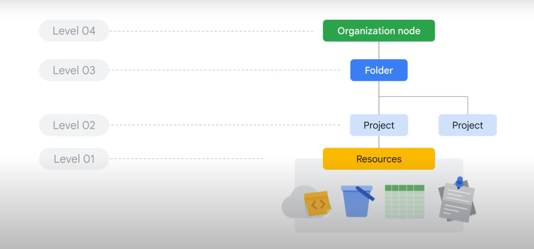
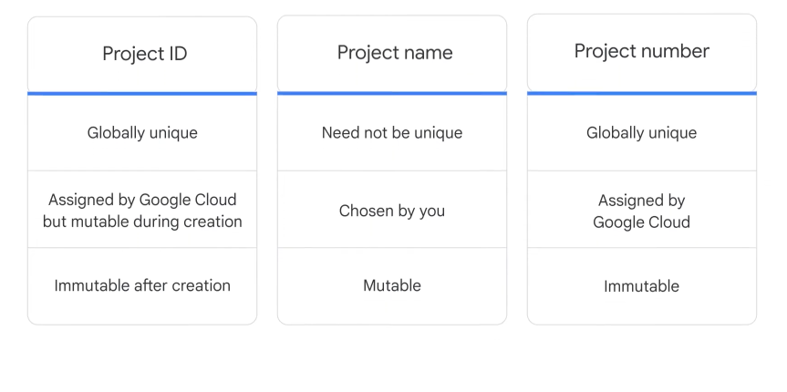
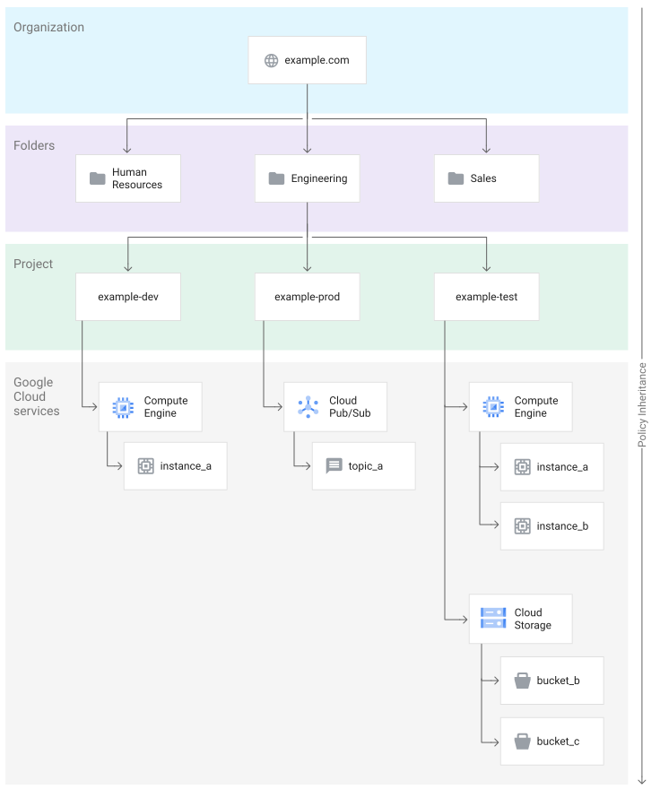
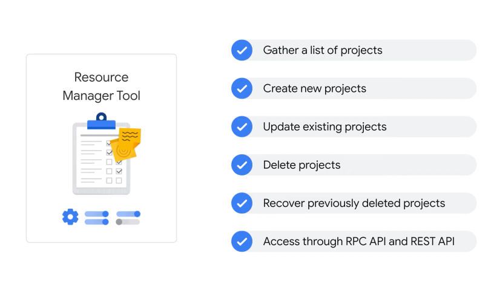

# Google Cloud Fundamentals Notes: Core infrastructure

## Cloud Overview IaaS vs PaaS

    IaaS 
        - includes VMs, Compute resources, Storage Buckets
        - IaaS Model pay for resources ahead of time 
    PaaS 
        - includes App Engine 
        - Serverless technologies offered by Google include Cloud Run, which allows customers to deploy their containerized microservices based application in a fully-managed environment
        - Cloud Run functions, which manages event-driven code as a pay-as-you-go service.
    SaaS
        - SaaS applicationss run in the cloud as a service and are consumed directly over the internet by end users.
        - Popular Google applications such as Gmail, Docs, and Drive, that are a part of Google Workspace, are all examples of SaaS.

## Resource & Access in the Cloud

    Google cloud resources have four levels starting from the bottom up 

    Resources (Level 01)
        - These represent virtual machines, Cloud Storage buckets, tables in BigQuery, or anything else in Google Cloud.

    Projects (Level 02 )
        - Resources are organized into Projects, which sit on the second level.
        - Projects are the basis for enabling and using Google Cloud services, like managing APIs, enabling billing, adding and removing collaborators, and enabling other Google services.
        - Each Google Cloud project has three identifying attributes: a project ID, a project name, and a project number.

    Folder ( Level 03 )
        - Projects can be organized into folders, or even subfolders.
        - To use folders, you must have an organization node, which is the very topmost resource in the Google Cloud hierarchy.
    
    Organization ( Level 04 )
        - At the top level is an organization node, which encompasses all the projects, folders, and resources in your organization.

## Policy Inheritance

    - Policies can be defined at the project, folder, and organization node levels.
    - Some Google Cloud services allow policies to be applied to individual resources, too.
    - Policies are also inherited downward ( Level 4 down to Level 1)
    - This means that if you apply a policy to a folder, it will also apply to all of the projects within that folder.

## Google Cloud Resource Manager

    - Google Cloud’s Resource Manager tool is designed to programmatically help you manage projects.
    - It’s an API that can gather a list of all the projects associated with an account, create new projects, update existing projects, and delete projects.
    - It can even recover projects that were previously deleted,and can be accessed through the RPC API and the REST API.

## Identity and Access Management (IAM)

### IAM 

    - IAM defines who (principals) can do what (roles/permissions) on which resources (org > folder > project > resource).
    - Principals: user accounts, Google groups, service accounts, Cloud Identity domains.
    - Roles bundle permissions; inheritance flows downward through the hierarchy.
    - Deny policies (where used) are evaluated before allow and can block granted permissions.
    - Role types:
        - Basic: Owner, Editor, Viewer, Billing Admin (broad).
        - Predefined: service-specific least privilege (e.g. compute.instanceAdmin).
        - Custom: created at org or project when predefined are too broad.
    - Use least privilege: prefer predefined; create custom only when needed.
    - Use service accounts for applications/workloads instead of user credentials.
    - Audit IAM bindings regularly and remove unused permissions.
    - Track project IDs and roles; avoid granting broad basic roles unnecessarily.
    - Document permission rationale for future reviews.
    - Principals: user account, group, service account, Cloud Identity domain.
    Roles bundle permissions; inheritance flows downward from the level granted.
    Deny policies (inherited) are evaluated before allow and can block permissions even if granted.
    - Role types:
        - Basic: owner, editor, viewer, billing admin (broad, project-wide).
        - Predefined: service-specific least-privilege (e.g., Compute Engine instanceAdmin).
        - Custom: tailor exact permissions; only at org or project level (not folder).
    - Use least privilege: prefer predefined; create custom only when predefined is too broad.

### Service Accounts 

## gcloud

    gcloud init 
    gcloud auth login 
    gcloud auth application-default login 
    gcloud auth list 
    gcloud config set project [PROJECT_ID] 
    gcloud config list 
    gloud projects list 
    gcloud config list
    gcloud projects create my_new_project 
    gcloud projects list 
    gcloud project delete my_new_project 
    gcloud billing accounts list

## gsutil

    clear the shell prompt 
    export PS1 ='$' 

## Some cloud shell bash commands

    pwd 
    clear 
    ls 
    free --giga
    lscpu 
    htop 

## gsutil  --> means google storage utility

### gsutil mb gs://rashid_storage

    This created storage space called rashid_storage 
